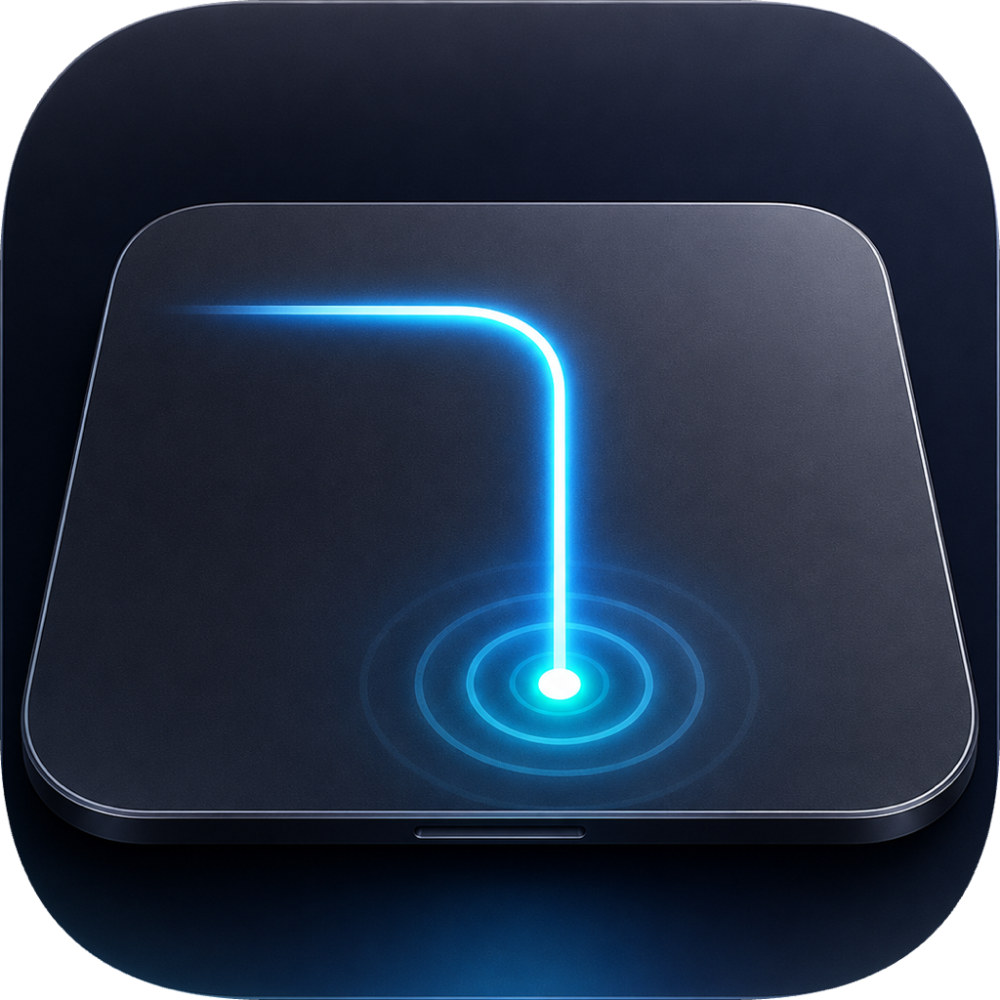

<div align="center">
  
  <h1>GlissPad</h1>
  <p><strong>A macOS trackpad productivity app for custom gestures and automation workflows.</strong></p>
  <p>
    Build trackpad triggers, chain actions in order, and keep the listener
    running from the menu bar while the editor window stays out of the way.
  </p>
  <p>
  <a href="#features">Features</a> ·
  <a href="#triggers">Triggers</a> ·
  <a href="#actions">Actions</a> ·
  <a href="#install-from-a-dmg">Install</a> ·
  <a href="#build-from-source">Build</a> ·
  <a href="#configuration">Configuration</a> ·
  <a href="#license">License</a>
  </p>
</div>

## Features

- Native macOS editor for triggers, actions, parameters, workflow testing, and
  drag reordering.
- One-finger, two-finger, three-finger, and four-finger trigger families with
  categorized picker menus and custom SVG icons.
- Ordered action workflows. Actions run from top to bottom and stop on failure.
- AppleScript, shell script, keyboard shortcut, test HUD, and latency actions.
- Keyboard shortcut timing controls for key hold duration and post-release
  delay.
- Menu bar control, settings window, and optional launch at login.
- Trigger enable switches, status indicators, import/export controls, and local
  JSON configuration.

GlissPad is still early. More trigger types, workflow actions, presets, and
documentation are still on the way.

## Triggers

GlissPad currently supports these trigger groups:

- **One finger:** touch start, long press, circle, square, triangle, corner
  click, tap, double tap, custom path, and drawn custom path.
- **Two fingers:** touch start, long press, tap, tip tap, pinch in/out,
  rotate left/right, free swipe, and region swipe.
- **Three fingers:** touch, tap, press, swipe, TipTap, TipSwipe,
  thumb + two fingers pinch/spread, and drawing recognition.
- **Four fingers:** touch, tap, press, swipe, TipTap,
  thumb + three fingers pinch/spread, and drawing recognition.
- **Release:** run a workflow when the last finger is released.

Several trigger types expose advanced parameters such as timing, movement
tolerance, pressure thresholds, start/end regions, active finger selection, and
drawing normalization.

## Actions

Each trigger owns an ordered action list:

- `Run AppleScript` runs the script through `/usr/bin/osascript`.
- `Run Shell Script` runs the script through `/bin/bash -lc`.
- `Keyboard Shortcut` sends a key or key combination, with configurable key
  down/up timing.
- `Pop up a test HUD` shows a small confirmation overlay.
- `Action Latency` waits for a configured duration before the next action.

AppleScript is best for macOS app automation, System Events, Finder commands,
and UI scripting. Shell scripts are best for command-line tools, files,
environment setup, and launching external commands.

## Requirements

- macOS 13 or newer. The Swift package declares `.macOS(.v13)` as its minimum
  supported platform.
- Xcode or Command Line Tools for building from source.
- Accessibility permission for global event observation and UI automation.

GlissPad reads trackpad data through Apple's private MultitouchSupport
framework, keeping the app native, lightweight, and local.

## Install From A DMG

Open the DMG, then drag `GlissPad.app` to `Applications`.

On first launch, macOS may ask for Accessibility permission. Grant permission to
GlissPad in `System Settings > Privacy & Security > Accessibility`, then restart
the app if needed.

If you build the DMG locally without a Developer ID certificate, macOS may show
the usual unsigned-app warning. Right-click `GlissPad.app` and choose `Open`, or
sign and notarize the app before distributing it.

## Build From Source

Build the app:

```sh
swift build -c release
```

Run the editor:

```sh
swift run glisspad
```

Run only the listener:

```sh
swift run glisspad --agent
```

Useful flags:

```sh
swift run glisspad --debug
swift run glisspad --config ./config.json
swift run glisspad --agent --no-permission-prompt
```

## Package A DMG

Create a drag-to-install DMG:

```sh
Scripts/package-macos-dmg.sh
```

The default output is:

```text
dist/GlissPad-v1.2.0.dmg
```

Set `GLISSPAD_VERSION` to build a different versioned artifact:

```sh
GLISSPAD_VERSION=1.2.1 Scripts/package-macos-dmg.sh
```

Set `GLISSPAD_CODESIGN_IDENTITY` to choose a signing identity. If it is not set,
the script tries the first local Apple Development identity and falls back to
ad-hoc signing.

## Configuration

The app stores user configuration at:

```text
~/Library/Application Support/GlissPad/config.json
```

The app bundle and DMG do not include this file. Local test triggers and actions
stay in the user's Application Support directory and are not packaged into a
release build.

Fresh installs start with an empty configuration. Users add triggers and actions
through the editor or import an exported JSON configuration.

Use `Export` and `Import` in the editor window to move configured triggers and
actions between machines. When imported trigger names conflict, GlissPad can
replace, skip, or keep both by renaming the imported trigger.

`config.example.json` contains a disabled example trigger that demonstrates the
current JSON shape. Most users should edit triggers through the native UI.

## Development

Run the test suite:

```sh
swift test
```

Install a local build into `/Applications`:

```sh
Scripts/install-macos-app.sh
```

The install script does not remove or rewrite your existing configuration.

## Troubleshooting

- If gestures are not detected, confirm Accessibility permission for the exact
  binary or app bundle you are running.
- If an AppleScript action fails, test the same script in Script Editor or with
  `osascript`.
- If a shell action fails, remember that it runs under `/bin/bash -lc`; use
  absolute paths when tools are not on the default PATH.
- If a workflow stops early, inspect the failing action first. Later actions do
  not run after a failure.

## License

MIT.
